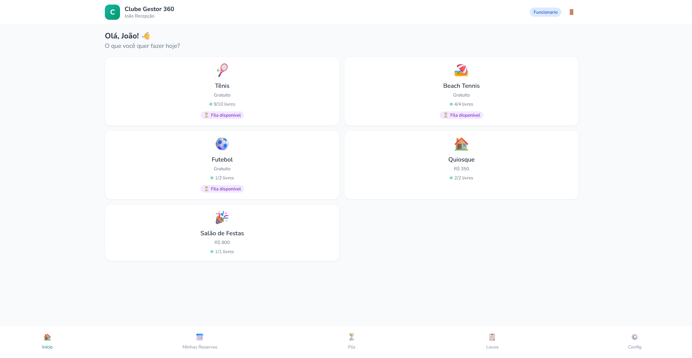
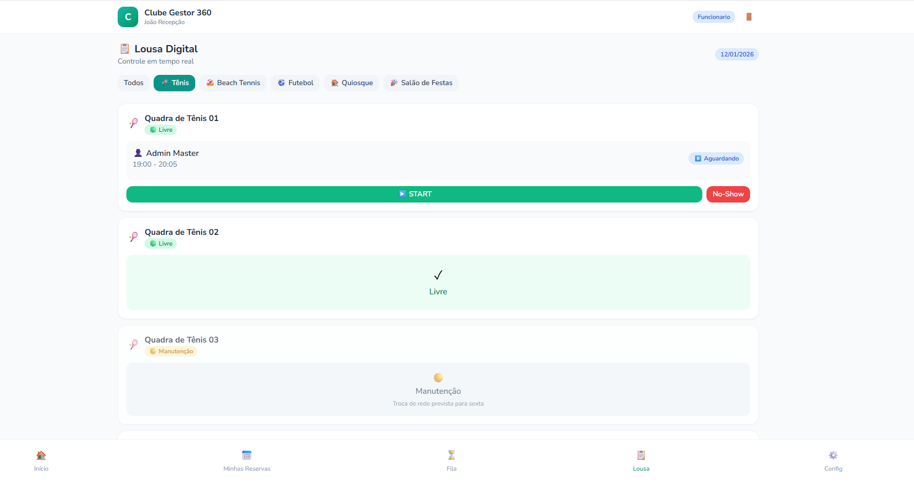
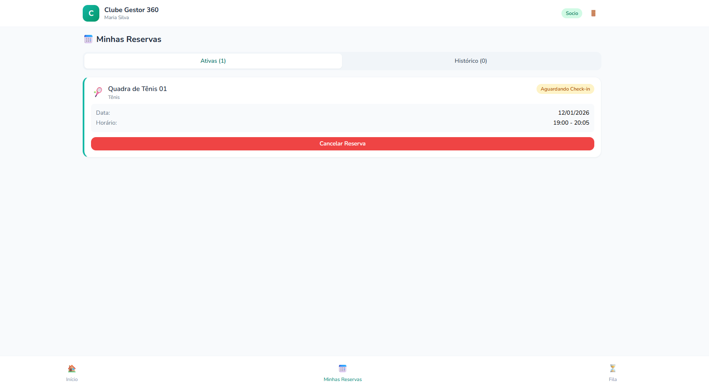

# 🎾 Clube Gestor 360

<div align="center">


**Sistema completo de gestão para clubes esportivos**

[Demo](#-demo) • [Funcionalidades](#-funcionalidades) • [Instalação](#-instalação) • [Uso](#-como-usar) • [Contribuir](#-contribuindo)

</div>

---

## 📸 Screenshots

<div align="center">
<table>
<tr>
<td align="center"><b>Home</b></td>
<td align="center"><b>Lousa Digital</b></td>
<td align="center"><b>Reserva</b></td>
</tr>
<tr>
<td></td>
<td></td>
<td></td>
</tr>
</table>
</div>

## ✨ Funcionalidades

### 👤 Para Sócios
- ✅ Login com matrícula (escalável)
- ✅ Visualização de quadras disponíveis em tempo real
- ✅ Reserva de recursos (Tênis, Beach Tennis, Futebol, etc)
- ✅ Fila de espera (check-in ou agendamento)
- ✅ Histórico de reservas
- ✅ Pagamento via PIX com upload de comprovante

### 👨‍💼 Para Funcionários
- ✅ Lousa Digital - controle em tempo real
- ✅ Timer com aquecimento (5min) + jogo (60min)
- ✅ Estender reserva (+1 hora)
- ✅ Encerrar reserva antecipadamente
- ✅ Registro de No-Show
- ✅ Gestão de sócios (bloqueio/desbloqueio)

### ⚙️ Para Administradores
- ✅ Gestão de quadras/recursos (CRUD completo)
- ✅ Programação de aulas (professor, dias, horários)
- ✅ Configuração de módulos (preço, duração, etc)
- ✅ Gestão de usuários
- ✅ Configurações do clube (PIX, punições, etc)

## 🚀 Demo

**[Acesse a Demo Online](https://seuusuario.github.io/clube-gestor-360)**

### Usuários de Teste

| Matrícula | Senha | Perfil |
|-----------|-------|--------|
| `ADM001` | `1234` | Administrador |
| `FUNC001` | `1234` | Funcionário |
| `SOC001` | `1234` | Sócio |

## 📦 Instalação

### Opção 1: Uso direto (sem instalação)

1. Baixe o arquivo `index.html`
2. Abra no navegador
3. Pronto! 🎉

### Opção 2: Via Git

```bash
git clone https://github.com/seuusuario/clube-gestor-360.git
cd clube-gestor-360
# Abra index.html no navegador
```

### Opção 3: GitHub Pages

1. Fork este repositório
2. Vá em Settings → Pages
3. Selecione branch `main` e pasta `/root`
4. Acesse `https://seuusuario.github.io/clube-gestor-360`

## 🎯 Como Usar

### Fluxo do Sócio
```
Login → Selecionar Módulo → Escolher Quadra → Data → Horário → Confirmar
```

### Fluxo do Funcionário (Lousa Digital)
```
1. Sócio chega → Funcionário vê reserva na Lousa
2. Clica START → Timer inicia (5min aquecimento + 60min jogo)
3. Timer amarelo → Aquecimento
4. Timer verde → Em jogo
5. Timer vermelho → Últimos 5 minutos
6. +1h → Estende | Encerrar → Finaliza
```

## 🏗️ Estrutura do Projeto

```
clube-gestor-360/
├── index.html          # 🎯 Aplicação completa (arquivo único)
├── README.md           # 📖 Documentação
├── LICENSE             # 📄 Licença MIT
├── .gitignore          # 🚫 Arquivos ignorados
├── src/                # 📁 Código fonte separado (referência)
│   ├── css/
│   │   └── styles.css  # 🎨 Estilos
│   └── js/
│       ├── config.js   # ⚙️ Configurações
│       ├── utils.js    # 🛠️ Utilitários
│       ├── components.jsx  # 🧩 Componentes
│       └── screens.jsx # 📱 Telas
└── docs/               # 📚 Documentação adicional
    └── screenshots/    # 📸 Capturas de tela
```

## ⚙️ Configuração

### Tempos (em `index.html`)
```javascript
const TEMPO_AQUECIMENTO = 5;   // minutos
const TEMPO_EXTENSAO = 60;     // minutos (+1 hora)
```

### Dados Iniciais
Edite os arrays no início do arquivo:
- `initialModulos` - Módulos (Tênis, Futebol, etc)
- `initialRecursos` - Quadras e recursos
- `initialAulas` - Aulas programadas
- `initialUsuarios` - Usuários do sistema

## 🎨 Status dos Recursos

| Status | Cor | Descrição |
|--------|-----|-----------|
| 🟢 Livre | Verde | Disponível |
| 🔵 Ocupada | Azul | Em uso |
| 🟡 Manutenção | Amarelo | Em reparo |
| 🟣 Reservada | Roxo | Aula/Evento |
| 🔴 Interditada | Vermelho | Imprópria |
| ⚪ Limpeza | Cinza | Em limpeza |

## 🛠️ Tecnologias

- **React 18** - Interface reativa
- **Tailwind CSS 3** - Estilização
- **Babel Standalone** - Compilação JSX no browser
- **PWA Ready** - Funciona offline

## 🤝 Contribuindo

1. Fork o projeto
2. Crie sua branch (`git checkout -b feature/NovaFuncionalidade`)
3. Commit suas mudanças (`git commit -m 'Add: nova funcionalidade'`)
4. Push para a branch (`git push origin feature/NovaFuncionalidade`)
5. Abra um Pull Request

## 📝 Roadmap

- [ ] Notificações push
- [ ] Integração com WhatsApp
- [ ] Relatórios e dashboards
- [ ] App mobile nativo
- [ ] Backend com banco de dados
- [ ] Sistema de torneios

## 📄 Licença

Este projeto está sob a licença MIT. Veja o arquivo [LICENSE](LICENSE) para mais detalhes.

## 👨‍💻 Autor

**Seu Nome**
- GitHub: [@seuusuario](https://github.com/seuusuario)

---

<div align="center">

⭐ **Se este projeto te ajudou, deixe uma estrela!** ⭐

</div>
